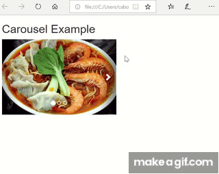
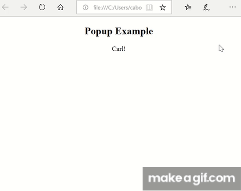

# Y2 2019 Summer: Web Development Challenge

Welcome to the webDev challenge! Please read all the instructions so you don't
get lost halfway through, but definitely feel free to ask for help if you
get stuck. Good luck, and have fun!

### Setup

Before you start coding, make sure you fork and clone the repository
for this lab:
```
cd ~/Desktop
git clone https://github.com/YOUR_GITHUB_USERNAME/y2s19-webDevChallenge.git
```

## Instructions
Working in teams of 4, your mission is to complete as many of these challenges as possible in one hour. Some challenges are easier or harder, but they all count for 1 point. It might be a good idea to read through the list first and then decide how to split them up. For each challenge, you need to create an example (you can have separate examples for separate challenges) and then at the end, the instructors will judge the examples and award points.

Your team starts with 5 tokens. You can turn in a token to receive at most 5 minutes of help from an instructor (use the help queue to ask for help). *This is all the help you can get, so use your tokens wisely.*

## Challenges

1. Image Carousel using photos of your favorite food.

Pop up - when you click on a name, text pops up with information

Flip card - show cards with people’s names on them, and then flips to show more information
Use a canvas to draw a circle
Use a canvas to create a game where you can move around
Vertical Navbar on the side of the screen - at least 3 links
Progress bar - increases by 1% each time you click a button
Countdown timer until Y3 graduation
A blue textbox with a green border and Comic sans font saying "Y2 is better than you"
Display a list of names, but in a randomized order
Search bar - can search for a name, and screen shows all matches
Textbox that is either 200 pixels wide or 50% of the screen, whichever is bigger
File upload button
Drop down list of several links
Navbar where the buttons are all pictures
Textbox that grows as you enter more text
A link that goes to another part of the same page
A page that automatically scrolls down slowly
Elements that fade out as you scroll down
Embed a youtube video
Text that appears on top of an image
50 pink rectangles
Play sound
A checkered background
Items disappear when you click on them
When hover over an image, text appears
Drag and drop
A box where user can draw
A table of pictures and labels
Background picture changes when you click a button
A quiz - a form that when entered, will tell you whether or not you got the question right
A timed page - after 2 seconds, something disappears
Make it possible to translate your page into other languages


